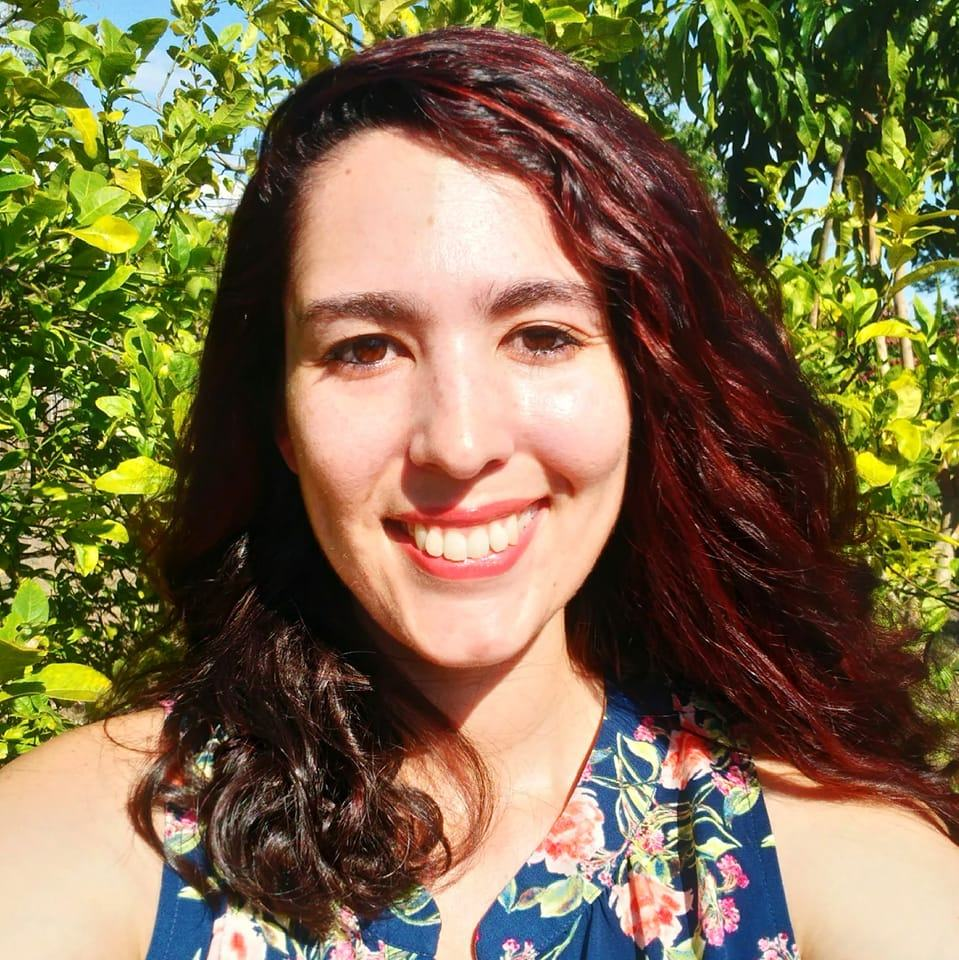

<p>

Welcome! Here you can find information about me. Currently, I'm a PhD candidate at the Department of Psychiatry of the Amsterdam UMC, location Academic Medical Center. My dissertation is on the transdiagnostic and network approach to psychopathology in a psychiatric population.

</p>

<p>

I have a background in clinical and social psychology and sociology and have been involved in research since 2011 when I started off as an undergraduate lab manager and research assistant. My current research uses the transdiagnostic and network approaches to investigate the interplay of various psychopathological domains. 

Broadly, my interests lie in research and data analytics in mental health care as well as general health care and social themes and issues, such as diversity and equity and sociodemographic topics. I'm also interested in the recovery-oriented model and psychosocial interventions, and the effect of environmental and social issues on mental health, well-being, daily functioning, and access to care, especially in marginalized populations. 

I am looking to start a new job starting from April or May 2023 as data analyst, researcher, or research coordinator in my areas of interest with a preference for remote or hybrid work in Randstad region of the Netherlands.

</p>

$$\\[.1cm]$$

<p style="text-align: center;">
[](https://www.linkedin.com/in/unyoung-chavez-baldini-b13743104/)$~~$
[](https://orcid.org/0000-0001-5613-513X)$~~$
[](https://www.researchgate.net/profile/Unyoung-Chavez-Baldini)$~~$
[](https://osf.io/tgxfv/)$~~$
[](https://scholar.google.com.mx/citations?user=5DPS-RsAAAAJ&hl=en&oi=ao)$~~$
[](https://github.com/uchavezbaldini)$~~$
[](mailto:u.chavezbaldini@gmail.com)
</p>

$$\\[.1cm]$$

```{r pic, echo=FALSE, out.width = '25%', fig.align='center'}

```

This website is built with R!
